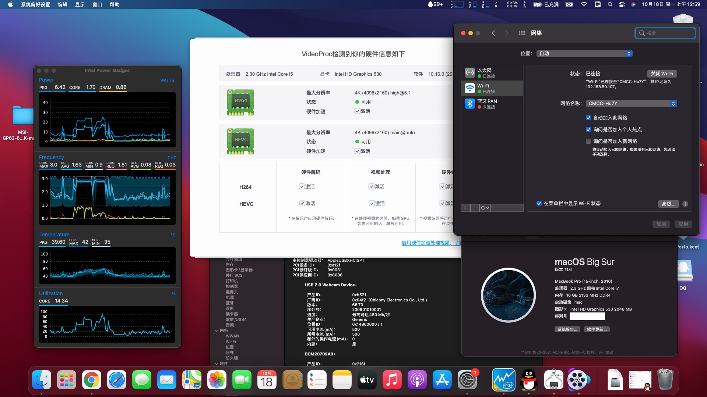

# MSI-GP62–6QG-1281XCN-HACKTOINSH-BAK
### 微星 GP62-6QG-1281XCN 国行 黑苹果备份
### OpenCore 0.7.4 + BigSur 12.6

### 说明

显卡使用 hackintool 打补丁，使用 SMBios MacPro13.3 与 0x191B0000 平台 ID，核心显卡可硬件加速，独显屏蔽。

声卡 ALC899，输出选 98 或 99 均可，开机喇叭会破音一次。

有线网卡可正常驱动，Wifi 和 蓝牙我换了 94352z （DW1560）可正常使用

屏幕亮度可调节，快捷键可正常使用，感谢@[0ranko0P](https://github.com/0ranko0P/GL62M-7RD-Hackintosh/tree/OC_Bigsur_DW1820A/kexts#function-keys)大佬。

USB已仿冒均可正常使用，读卡器还没折腾不知道能不能用。

休眠睡眠正常。

完美触控板也没做，但不影响使用。

还没测 HDMI 和 DP 输出，但应该问题不大。

### BIOS 设置

请参考 https://github.com/jbwharris/hackintosh-msi-GL72M-7RDX#older_man-bios-configuration 

### 问题

- 寻找解决喇叭破音方案

- ~~USB-TypeC 无法使用~~
- ~~休眠正常~~ 感谢@[0ranko0P](https://github.com/0ranko0P/GL62M-7RD-Hackintosh/tree/OC_Bigsur_DW1820A/kexts#function-keys)大佬。

- 后期折腾读卡器和完美触控板

### 鸣谢

> https://github.com/chuxubank/MSI-GP62-Hackintosh

> https://github.com/0ranko0P/GL62M-7RD-Hackintosh

> https://github.com/ForceGT/Hackintosh--MSIGL62M-7RDX

> https://github.com/ForceGT/Hackintosh--MSIGL62M-7RDX

> https://github.com/jbwharris/hackintosh-msi-GL72M-7RDX

